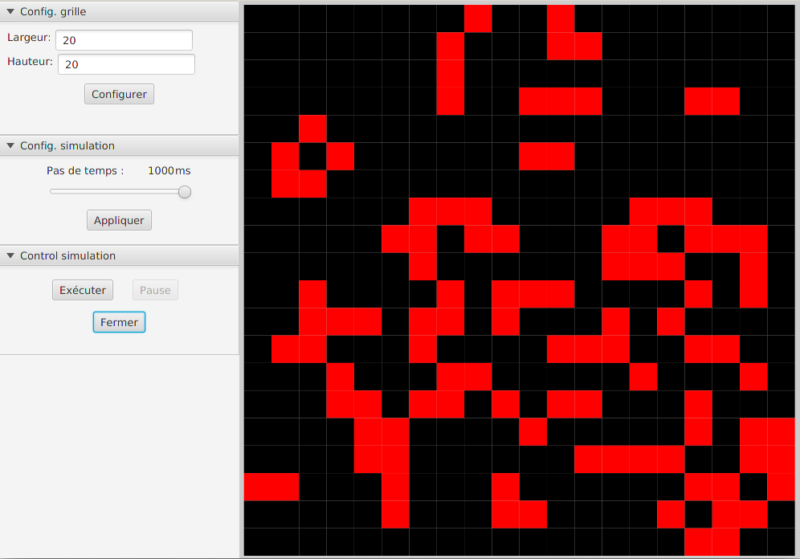

# Game of Life Demonstration

The goal of this demo is to bring out an implementation of the Game of Life using SARL agents.

The Game of Life is a cellular automaton devised by the British mathematician John Horton Conway in 1970.
The game is a zero-player game, meaning that its evolution is determined by its initial state, requiring
no further input. A specific agent interacts with the Game of Life by creating an initial configuration
and observing how it evolves.

The application is composed of a grid of agents. Each of which is in one of two possible states, alive or dead.
Every cell agent interacts with its eight neighbours, which are the cells that are horizontally, vertically, or
diagonally adjacent. At each step in time, the following transitions occur:

1. Any live cell agent with fewer than two live neighbors dies, as if by under population.
2. Any live cell agent with two or three live neighbors lives on to the next generation.
3. Any live cell agent with more than three live neighbors dies, as if by overpopulation.
4. Any dead cell agent with exactly three live neighbors becomes a live cell agent, as if by reproduction.

The initial pattern constitutes the seed of the system. The first generation is created by applying the above
rules simultaneously to every cell in the seed; births and deaths occur simultaneously, and the discrete moment
at which this happens is sometimes called a tick. Each generation is a pure function of the preceding one.
The rules continue to be applied repeatedly to create further generations.

